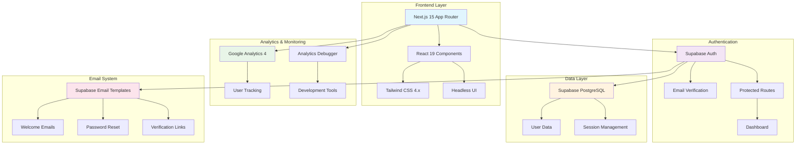

# Binary Prototypes

Binary Prototypes (Try Catch Robotics) is a modern web application that makes STEM education accessible and engaging for middle school students through hands-on robotics training. Built with Next.js 15, React 19, and Supabase authentication.

## 🎯 Mission

Empowering young innovators through robotics education, building tomorrow's innovators today.

## 🏗️ Architecture



## 🚀 Features

### Educational Focus
- **Programming Fundamentals**: Build strong coding foundations through hands-on projects
- **Engineering Principles**: Understand design and mechanical systems by building real robots
- **Critical Thinking Skills**: Develop problem-solving abilities through creative challenges
- **Real-World Applications**: Create robots that address practical challenges

### Technical Features
- **Modern Authentication**: Supabase-powered email verification and secure login
- **Responsive Design**: Mobile-first approach with Tailwind CSS
- **Analytics Integration**: Google Analytics 4 for user behavior tracking
- **Protected Dashboard**: Secure user area with session management
- **Email Templates**: Professional, branded email communications

## 🛠️ Technology Stack

- **Frontend**: Next.js 15, React 19, TypeScript
- **Styling**: Tailwind CSS 4.x, Headless UI
- **Authentication**: Supabase Auth with email verification
- **Database**: Supabase PostgreSQL
- **Analytics**: Google Analytics 4
- **Email**: Supabase email templates
- **Deployment**: Vercel-ready

## 🚀 Getting Started

### Prerequisites
- Node.js 18+ 
- npm or pnpm
- Supabase account (for authentication)

### Installation

1. **Clone the repository**
   ```bash
   git clone <repository-url>
   cd binaryprototypes-com
   ```

2. **Install dependencies**
   ```bash
   npm install
   ```

3. **Set up environment variables**
   ```bash
   cp .env.local.example .env.local
   ```
   
   Add your configuration to `.env.local`:
   ```bash
   # Supabase Configuration
   NEXT_PUBLIC_SUPABASE_URL=your-supabase-project-url
   NEXT_PUBLIC_SUPABASE_ANON_KEY=your-supabase-anon-key
   
   # Google Analytics (optional)
   NEXT_PUBLIC_GA_ID=G-XXXXXXXXXX
   ```

4. **Run the development server**
   ```bash
   npm run dev
   ```

5. **Open your browser**
   Navigate to [http://localhost:3000](http://localhost:3000) to view the website.

### Available Scripts

- `npm run dev` - Start development server
- `npm run build` - Build for production
- `npm run start` - Start production server
- `npm run lint` - Run ESLint

## 📊 Analytics & Monitoring

This project includes Google Analytics 4 (GA4) integration for tracking user behavior and engagement:

1. **Set up Google Analytics**
   - Create a GA4 property in Google Analytics
   - Add your Measurement ID to `.env.local`:
   ```bash
   NEXT_PUBLIC_GA_ID=G-XXXXXXXXXX
   ```

2. **Analytics Features**
   - User behavior tracking
   - Page view analytics
   - Custom event tracking
   - Development debugging tools

For detailed setup instructions, see [docs/GOOGLE_ANALYTICS_SETUP.md](./docs/GOOGLE_ANALYTICS_SETUP.md).

## 🔐 Authentication Setup

The application uses Supabase for authentication with email verification:

1. **Create Supabase Project**
   - Sign up at [supabase.com](https://supabase.com)
   - Create a new project
   - Get your project URL and anon key

2. **Configure Email Templates**
   - Set up custom email templates in Supabase dashboard
   - Use the templates provided in [docs/SUPABASE_EMAIL_TEMPLATES.md](./docs/SUPABASE_EMAIL_TEMPLATES.md)

3. **Environment Variables**
   ```bash
   NEXT_PUBLIC_SUPABASE_URL=your-project-url
   NEXT_PUBLIC_SUPABASE_ANON_KEY=your-anon-key
   ```

For complete setup instructions, see [docs/SUPABASE_SETUP_GUIDE.md](./docs/SUPABASE_SETUP_GUIDE.md).

## 📁 Project Structure

```
src/
├── app/                    # Next.js App Router
│   ├── (auth)/            # Authentication pages
│   ├── dashboard/         # Protected user dashboard
│   └── layout.tsx         # Root layout
├── components/            # React components
│   ├── Header.tsx         # Navigation header
│   ├── Hero.tsx           # Landing page hero
│   ├── PrimaryFeatures.tsx # Main features section
│   └── ...                # Other UI components
├── lib/                   # Utility libraries
│   ├── supabase/          # Supabase client setup
│   └── auth-helpers.ts    # Authentication utilities
└── styles/                # Global styles
    └── tailwind.css       # Tailwind CSS configuration
```

## 🎨 Customization

### Branding
- Update logo and colors in `src/components/Logo.tsx`
- Modify brand colors in `tailwind.config.js`
- Customize email templates in Supabase dashboard

### Content
- Edit page content in component files
- Update FAQ section in `src/components/Faqs.tsx`
- Modify pricing information in `src/components/FirstCohortPricing.tsx`

### Styling
- Global styles: `src/styles/tailwind.css`
- Component-specific styles using Tailwind classes
- Custom fonts configured in `src/app/layout.tsx`

## 📚 Documentation

- [Supabase Integration Plan](./docs/SUPABASE_INTEGRATION_PLAN.md) - Complete implementation overview
- [Supabase Setup Guide](./docs/SUPABASE_SETUP_GUIDE.md) - Step-by-step setup instructions
- [Email Templates](./docs/SUPABASE_EMAIL_TEMPLATES.md) - Custom email template designs
- [Google Analytics Setup](./docs/GOOGLE_ANALYTICS_SETUP.md) - Analytics configuration guide

## 🤝 Contributing

1. Fork the repository
2. Create a feature branch (`git checkout -b feature/amazing-feature`)
3. Commit your changes (`git commit -m 'Add amazing feature'`)
4. Push to the branch (`git push origin feature/amazing-feature`)
5. Open a Pull Request

## 📄 License

This project is licensed under the MIT License - see the [LICENSE.md](./LICENSE.md) file for details.

## 🔗 Learn More

- [Next.js Documentation](https://nextjs.org/docs) - Learn about Next.js features and API
- [Tailwind CSS](https://tailwindcss.com/docs) - Utility-first CSS framework
- [Supabase Documentation](https://supabase.com/docs) - Backend-as-a-Service platform
- [Headless UI](https://headlessui.dev) - Unstyled, accessible UI components

---

**Binary Prototypes** - Empowering young innovators through robotics education 🚀
